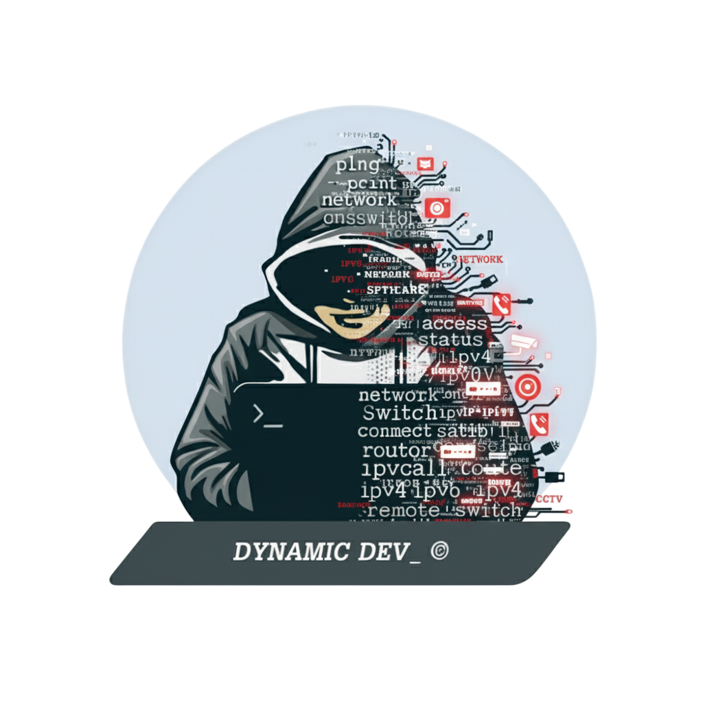

  

<h1 align="center">Hi there 👋 I'm Thanathip SamarTt (James)</h1>

  <strong>The alias "dynamicdev_" | Professional Solution Builder</strong>

  
  

---

### 🛠 About Me
* **Current Role:** Installer Engineer & Technical Support (Full-time) 🛠️
* **Expertise:** System Engineer (Past Experience) | Network Deployment
* **Based in:** Rama II - Bangkhunthien, Bangkok, Thailand 🌍
* **Contact:**   * 📫 `james.dynamicdev@gmail.com`
                 * 🌐 `support@dynamicdev.asia`
* **Focus:** Currently working on specialized projects under **alias Organizations** 🚀

### 🧠 Knowledge & Learning
> I'm a self-taught enthusiast constantly evolving in the technology ecosystem.
* 📖 Currently deep-diving into **CCNA (Cisco Certified Network Associate)**.
* 💻 Exploring Software Ecosystems and Computer Systems during my working intervals.
* 👥 Always looking to collaborate on: **Self-Hosting Projects**, **Networking Software Development**, and **Network Engineering**.

> **Mindset:** I handle high pressure with an excellent teamwork spirit. I am attentive, alert, and dedicated to bringing every project to success. Ready to receive all-round development. Please feel free to share or teach me more knowledge!

---

### 🎓 Education & Certifications

#### 🏫 Formal Education
* **University (Unsuccessful, 2017 - 2018)**
    * *Faculty of Engineering, Dept. of Electronics and Telecommunications Engineering*
    * Rajamangala University of Technology Krungthep (RMUTK)

#### 📜 Certificates
* **Cisco Certified Support Technician (CCST)** - *Cisco Networking Academy*
    * ✅ Networking Basics
    * ✅ Networking Devices and Initial Configuration
    * ✅ Networking Addressing and Troubleshooting
    * ✅ Network Support and Security
    * ✅ Network Technician Career Path

---

### 💻 Skills & Digital Badges

#### **IT & Programming**

  
  
  
  
  
  

#### **Networking Badges**

  

### 📨 Socials Media for Contacts about job or any knowledge 

 
   <a href="https://www.github.com/dynamicdev-jamesdynamicdev" target="_blank" rel="noreferrer"> <picture> <source media="(prefers-color-scheme: dark)" srcset="https://raw.githubusercontent.com/danielcranney/readme-generator/main/public/icons/socials/github-dark.svg" /> <source media="(prefers-color-scheme: light)" srcset="https://raw.githubusercontent.com/danielcranney/readme-generator/main/public/icons/socials/github.svg" />  </picture> </a> <a href="https://www.linkedin.com/in/dynamicdev" target="_blank" rel="noreferrer"> <picture> <source media="(prefers-color-scheme: dark)" srcset="https://raw.githubusercontent.com/danielcranney/readme-generator/main/public/icons/socials/linkedin-dark.svg" /> <source media="(prefers-color-scheme: light)" srcset="https://raw.githubusercontent.com/danielcranney/readme-generator/main/public/icons/socials/linkedin.svg" />  </picture> </a> <a href="https://www.youtube.com/@DynamicDEV_" target="_blank" rel="noreferrer"> <picture> <source media="(prefers-color-scheme: dark)" srcset="https://raw.githubusercontent.com/danielcranney/readme-generator/main/public/icons/socials/youtube-dark.svg" /> <source media="(prefers-color-scheme: light)" srcset="https://raw.githubusercontent.com/danielcranney/readme-generator/main/public/icons/socials/youtube.svg" />  </picture> </a> <a href="https://www.facebook.com/account.dynamicdev" target="_blank" rel="noreferrer"> <picture> <source media="(prefers-color-scheme: dark)" srcset="https://raw.githubusercontent.com/danielcranney/readme-generator/main/public/icons/socials/facebook-dark.svg" /> <source media="(prefers-color-scheme: light)" srcset="https://raw.githubusercontent.com/danielcranney/readme-generator/main/public/icons/socials/facebook.svg" />  </picture> </a>

---

  Copyright 2025 © <strong>dynamicdev_</strong> — All Rights Reserved

